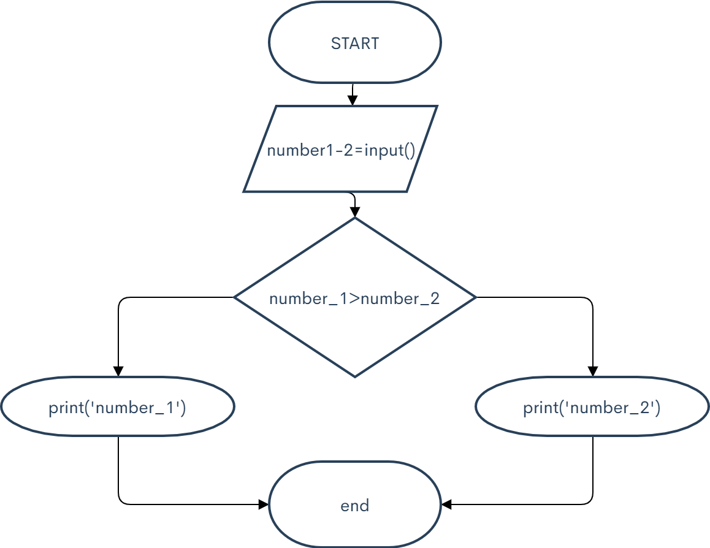
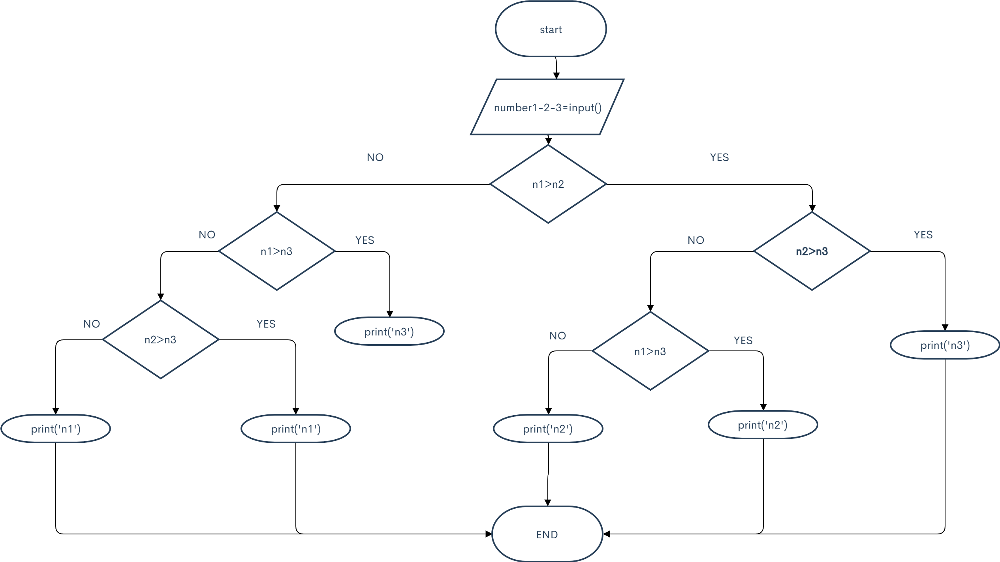

# Solution to if exercises in snakify

## 1 Minimum of two numbers

```.py
number_1 =int(input('Please write your first number.'))
number_2 =int(input('Please write your second number.'))
if number_1 > number_2 :
    print(number_2 )
else:
    print(number_1 )
```

## 2 Sign function

```.py
number = int(input('Please enter your number.'))
if number > 0 :
    print(1)
if number < 0 :
    print(-1)
if number == 0 :
    print(0)
```

## 3 Minimum of three numbers

```.py
n1=int(input('Please enter your first number.'))
n2=int(input('Please enter your second number.'))
n3=int(input('Please enter your third number.'))
if n1>n2:
    if n2>n3:
        print(n3)
    else:
        print(n2)
else:
    if n1>n3:
        print(n3)
    else:
        print(n1)
```

## 4 Equal Numbers
```.py
n1=int(input('Please enter your first number.'))
n2=int(input('Please enter your second number.'))
n3=int(input('Please enter your third number.'))
if n1==n2:
    if n3==n2:
        print(3)
    else:
        print(2)
else:
    if n3==n1:
        print(2)
    else:
        if n2==n3:
            print(2)
        else:
            print(0)
```.py

## 6 Chess board-same colour
```.py
n1 = int(input('Please enter your first number.'))
n2 = int(input('Please enter your second number.'))
n3 = int(input('Please enter your third number.'))
n4 = int(input('Please enter your fourth number.'))
if (n1+n2) % 2:
    if (n3+n4) % 2:
        print('YES')
    else:
        print('NO')
else:
    if (n3+n4) % 2:
        print('NO')
    else:
        print('YES')
```
##  7 King move

```.py
n1 = int(input('Please enter your first number.'))
n2 = int(input('Please enter your second number.'))
n3 = int(input('Please enter your third number.'))
n4 = int(input('Please enter your fourth number.'))
if (n1-n3)<2:
    if (n1-n3)>-2:
        if (n2-n4)<2:
            if (n2-n4)>-2:
                print('YES')
            else:
                print('NO')
        else:
                print('NO')
    else:
                print('NO')
else:
                print('NO')
        
    

```
