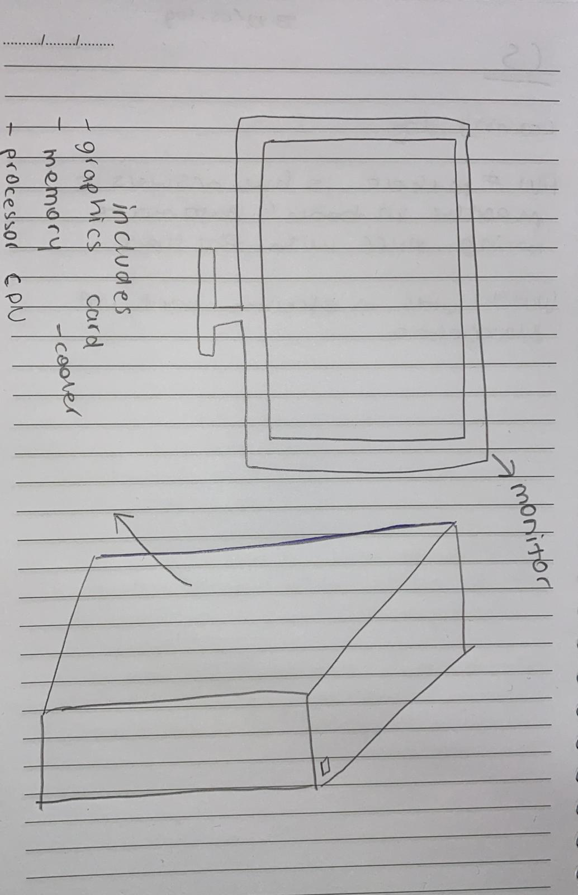

# Lesson 1 

## Drawing of a computer
This is my drawing of a computer as ı know today 25th of August

Variables are the part of programming which can vary from customer to customer. Info like the age , location or basically name can be a good example for variables. It is also like creating a label /checkpoint of the things we will later use in our code.Lastly it helps us to call out the value by writing the variable.

The variables used in Python
int = is used for integers
long= is used for longer integers
float= the outcome of the process
complex= complex numbers

